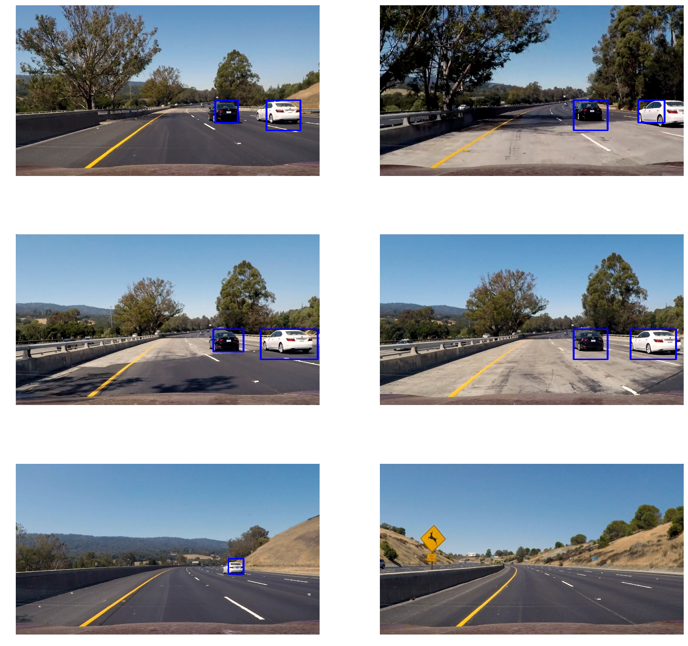

## Writeup Template
### You can use this file as a template for your writeup if you want to submit it as a markdown file, but feel free to use some other method and submit a pdf if you prefer.

---

**Vehicle Detection Project**

The goals / steps of this project are the following:

* Perform a Histogram of Oriented Gradients (HOG) feature extraction on a labeled training set of images and train a classifier Linear SVM classifier
* Optionally, you can also apply a color transform and append binned color features, as well as histograms of color, to your HOG feature vector.
* Note: for those first two steps don't forget to normalize your features and randomize a selection for training and testing.
* Implement a sliding-window technique and use your trained classifier to search for vehicles in images.
* Run your pipeline on a video stream (start with the test_video.mp4 and later implement on full project_video.mp4) and create a heat map of recurring detections frame by frame to reject outliers and follow detected vehicles.
* Estimate a bounding box for vehicles detected.


### Histogram of Oriented Gradients (HOG)

#### 1. Explain how (and identify where in your code) you extracted HOG features from the training images.

The code for this step is attached below. It is basically an adaptation of the code provided in the lectures. It is also in the iPython notebook.
```python
def get_hog_features(
    img, orientation,
    pix_per_cell, cell_per_block,
    vis=False, feature_vec=True):
    """Code duplicated from lectures
    """
    if vis == True:
        (features, hog_image) = hog(
            img,
            orientations=orientation,
            pixels_per_cell=(pix_per_cell, pix_per_cell),
            cells_per_block=(cell_per_block, cell_per_block),
            transform_sqrt=False,
            visualise=vis,
            feature_vector=feature_vec,
            )
        return (features, hog_image)
    else:
        features = hog(
            img,
            orientations=orientation,
            pixels_per_cell=(pix_per_cell, pix_per_cell),
            cells_per_block=(cell_per_block, cell_per_block),
            transform_sqrt=False,
            visualise=vis,
            feature_vector=feature_vec,
            )

        return features
```
I started by reading in all the `vehicle` and `non-vehicle` images.  Here is an example of one of each of the `vehicle` and `non-vehicle` classes:


I then explored different color spaces and different `skimage.hog()` parameters (`orientations`, `pixels_per_cell`, and `cells_per_block`).  I grabbed random images from each of the two classes and displayed them to get a feel for what the `skimage.hog()` output looks like.

Here is an example using the `YCrCb` color space and HOG parameters of `orientations=9`, `pixels_per_cell=(8, 8)` and `cells_per_block=(2, 2)`:


#### 2. Explain how you settled on your final choice of HOG parameters.

I played around with some approaches but ultimately settled on the recommendation of the lectures on using between 9–11 for the orientation and 2 cells per block with 8 pixels per cell.

#### 3. Describe how (and identify where in your code) you trained a classifier using your selected HOG features (and color features if you used them).

I first created my dataset with the following code:
```python
# Global Variables
orient = 11
colorspace = 'YUV'
pix_per_cell = 8
cell_per_block = 2
hog_channel = 'ALL'

car_features = extract_features(car_images, cspace=colorspace, orient=orient,
                        pix_per_cell=pix_per_cell, cell_per_block=cell_per_block,
                        hog_channel=hog_channel)

notcar_features = extract_features(noncar_images, cspace=colorspace, orient=orient,
                        pix_per_cell=pix_per_cell, cell_per_block=cell_per_block,
                        hog_channel=hog_channel)

X = np.vstack((car_features, notcar_features)).astype(np.float64)
y = np.hstack((np.ones(len(car_features)), np.zeros(len(notcar_features))))


X_train, X_test, y_train, y_test = train_test_split(X, y, test_size=0.2)
```
This gave me a dataset on which I could train an SVG classifier. The training was just a matter of using the awesome `scikit` library to fit the training set. Here is the code for that:
```python
svc = LinearSVC()
svc.fit(X_train, y_train)
```
### Sliding Window Search

#### 1. Describe how (and identify where in your code) you implemented a sliding window search.  How did you decide what scales to search and how much to overlap windows?

Here is the code that I used to accomplish the sliding window technique. I will explain my decisions after. Essentially this code is highly adapted from the lectures which provided a very good start to this whole project.
```python
def find_cars(image, ystart, ystop, scale, cspace, hog_channel, svc, X_scaler, orient,
              pix_per_cell, cell_per_block, spatial_size, hist_bins):

    rectangles = []
    image = image.astype(np.float32) / 255
    image_to_search = image[ystart:ystop,:,:]
    ctrans_tosearch = convert_colorspace(image_to_search, cspace)

    if scale != 1:
        imshape = ctrans_tosearch.shape
        ctrans_tosearch = cv2.resize(
            ctrans_tosearch, (np.int(imshape[1]/scale), np.int(imshape[0]/scale)))

    if hog_channel == 'ALL':
        channel_1 = ctrans_tosearch[:, :, 0]
        channel_2 = ctrans_tosearch[:, :, 1]
        channel_3 = ctrans_tosearch[:, :, 2]
    else:
        channel_1 = ctrans_tosearch[:,:,hog_channel]

    nxblocks = (channel_1.shape[1] // pix_per_cell)+1  #-1
    nyblocks = (channel_1.shape[0] // pix_per_cell)+1  #-1

    window = 64
    nblocks_per_window = (window // pix_per_cell)-1
    cells_per_step = 2
    nxsteps = (nxblocks - nblocks_per_window) // cells_per_step
    nysteps = (nyblocks - nblocks_per_window) // cells_per_step

    hog1 = get_hog_features(channel_1, orient, pix_per_cell, cell_per_block, feature_vec=False)

    if hog_channel == 'ALL':
        hog2 = get_hog_features(channel_2, orient, pix_per_cell, cell_per_block, feature_vec=False)
        hog3 = get_hog_features(channel_3, orient, pix_per_cell, cell_per_block, feature_vec=False)

    for xb in range(nxsteps):
        for yb in range(nysteps):
            ypos = np.multiply(yb, cells_per_step)
            xpos = np.multiply(xb, cells_per_step)

            hog_feature_one = hog1[ypos:ypos+nblocks_per_window, xpos:xpos+nblocks_per_window].ravel()

            if hog_channel == 'ALL':
                hog_feature_two = hog2[ypos:ypos+nblocks_per_window, xpos:xpos+nblocks_per_window].ravel()
                hog_feature_three = hog3[ypos:ypos+nblocks_per_window, xpos:xpos+nblocks_per_window].ravel()
                hog_features = np.hstack((hog_feature_one, hog_feature_two, hog_feature_three))
            else:
                hog_features = hog_feature_one

            xleft = np.multiply(xpos, pix_per_cell)
            ytop = np.multiply(ypos, pix_per_cell)

            test_prediction = svc.predict([hog_features])

            if test_prediction == 1:
                xbox_left = np.int(xleft * scale)
                ytop_draw = np.int(ytop * scale)
                win_draw = np.int(window * scale)
                rectangles.append(((xbox_left, ytop_draw+ystart),
                    (xbox_left +win_draw,ytop_draw+win_draw+ystart)))

    return rectangles
```
As I mentioned, I adapted the method from the sliding windows from the lesson materials.
The method combines HOG feature extraction with a sliding window search, but rather than perform feature extraction on each window individually which can be time consuming, the HOG features are extracted for the entire image and then features are subsampled according to the size of the window and then fed to the classifier. The method performs the classifier prediction on the HOG features for each window region and returns a list of rectangle objects corresponding to the windows that generated a positive ("car") prediction. In terms of finding scales and overlap parameters, it was a matter of trial and error and I ended up choosing 1, 1.5, 2 and 3.5 scales that seemed to give the best results. I have also tried using a 3.0 scale but the difference between 2 and 3 didn't increase the accuracy sufficiently where as 3.5 did. Originally the window overlap was set to 50% in both X and Y directions, but an overlap of 75% in the Y direction more  true positive detection that allowed me to filter them using the heat map threshold below.  Moreover, the search area was limited to where cars would appear in the image and ignored areas where cars were not likely to appear, such as the skyline. The final implementation considers 190 window locations, which proved to be robust enough to reliably detect vehicles while maintaining a high speed of execution.

#### 2. Show some examples of test images to demonstrate how your pipeline is working.  What did you do to optimize the performance of your classifier?
Here are some images from the pipeline and various processing techniques. I didn't do much to optimize the performance aside from checking different colorspaces and ended up sticking with the `YUV` colorspace.


---

### Video Implementation

#### 1. Provide a link to your final video output.  Your pipeline should perform reasonably well on the entire project video (somewhat wobbly or unstable bounding boxes are ok as long as you are identifying the vehicles most of the time with minimal false positives.)
Here's a [link to my video result](https://youtu.be/7gTg0GIN3tI)


#### 2. Describe how (and identify where in your code) you implemented some kind of filter for false positives and some method for combining overlapping bounding boxes.

I recorded the positions of positive detections in each frame of the video.  From the positive detections I created a heatmap and then thresholded that map to identify vehicle positions.  I then used `scipy.ndimage.measurements.label()` to identify individual blobs in the heatmap.  I then assumed each blob corresponded to a vehicle.  I constructed bounding boxes to cover the area of each blob detected.

Here's an example result showing the heatmap from a series of frames of video, the result of `scipy.ndimage.measurements.label()` and the bounding boxes then overlaid on the last frame of video:


### Here is a heatmap for one frame.


### Here is the output of `scipy.ndimage.measurements.label()` on the integrated heatmap from one frame


### Here the resulting bounding boxes are drawn onto a frame:

---

### Discussion

#### 1. Briefly discuss any problems / issues you faced in your implementation of this project.  Where will your pipeline likely fail?  What could you do to make it more robust?
I had some trouble initially with putting the pipeline together. Whereas the code in the lectures was very helpful to start off with, because it was not written in an OOP way, it was difficult for me to grasp how the pieces fit and worked together. But after spending some time understanding the individual pieces, I was able to produce a working pipeline.
Some places where my pipeline fails is when the cars are too far away but only in certain places. One way I could probably fix is this by trying smaller search areas but this might result in a slower pipeline overal..
